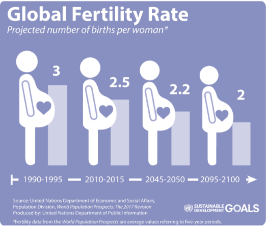
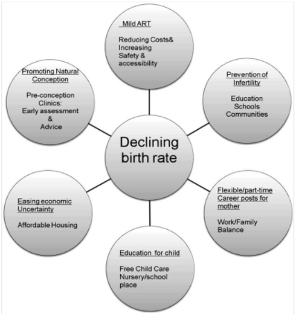

# 2021Fall_finals: 

# Analysis and Critique of “Declining birth rate in Developed Countries: A radical policy re-think is required by G. Nargund”:  An Analysis of Factors Affecting Global Fertility Rates

By Anish Shetty, Saish Desai, and Terry Jeon

Link of the Video presentation for our Final Project - https://mediaspace.illinois.edu/media/t/1_lr6ashco

## What is fertility rate and how is it different from birth rate?
  
Fertility rate is defined as the total number of children women would hypothetically birth assuming survival which is what we are exploring.
Birth rate is defined as the total number of actual births within a specific time period.
Replacement fertility rate is defined as the minimum fertility rate necessary to maintain a nation’s population.

## The Issue of Decreasing Global Fertility Rates
  
Global fertility rates have been steadily decreasing since the late 1960s.
Specific countries have birth rates that are lower than the statistical replacement birth rate.
This can result in a country with a disproportionately large elderly population which can be difficult to sustain economically.

## Article: Declining birth rate in Developed Countries: A radical policy re-think is required by G. Nargund
  
This was an article written in 2009 and addresses the issue of decreasing global birth rates. It also describes factors that are potentially contributing to decreasing global fertility rates. However, data sources were not cited in the article and there were no details for analysis provided. Therefore, our goal was to determine if select statements made by the article are supported by data. The analysis that we'll be exploring in our project can be broadly categorized into four factors that we believe play an important role in the trend of decreasing fertility rates: economic growth, child and maternal mortality, family expenditure on a child , and religiosity.

## Here is a list of the Hypothesis we are going to explore in our analysis
Hypothesis 1: There is a strong relationship with a correlation coefficient greater than 0.6 between fertility rate and three economic factors: GDP, Income per Capita, and Inflation.

Hypothesis 2: Fertility rate in countries having low GNI (Gross National Income per capita) will be higher compared to other countries. At the same time, due to higher maternal and perinatal mortality, there is a reduction in birth rates for such countries.¶

Hypothesis 3: The percentage share of housing, food, transportation, clothing, healthcare, child care and education and other miscellaneous expenses for a child will increase with time, being a contributing factor affecting the native fertility of US.¶

Hypothesis 4: Faith, Religion and Religious authority tend to affect a country’s TFR. Countries which are predominantly religious, will have majority of its population following religious practices, which mainly tend to be against abortion, birth prevention, and other family planning methods. We shall compare such countries with the least religious countries and see how drastically TFR varies along with mean years of schooling for females.

## Sources:  
### Datasets:
Fertility Rate dataset: https://data.worldbank.org/indicator/SP.DYN.TFRT.IN

Inflation dataset:  https://data.worldbank.org/indicator/FP.CPI.TOTL.ZG?view=chart

Female Unemployment dataset: https://data.worldbank.org/indicator/SL.UEM.TOTL.FE.ZS?view=chart

Infant Mortality dataset: https://data.worldbank.org/indicator/SP.DYN.IMRT.IN

Maternal Mortality Data: https://data.worldbank.org/indicator/SH.STA.MMRT.NE

Birth Rate Data: https://data.worldbank.org/indicator/SP.DYN.CBRT.IN

GDP dataset: https://data.worldbank.org/indicator/NY.GDP.MKTP.CD

Income per Capita data: https://data.worldbank.org/indicator/NY.ADJ.NNTY.PC.CD

Data for Education: http://hdr.undp.org/en/data

Child Bearing Expenditure: https://www.fns.usda.gov/resource/expenditures-children-families-reports-all-years 

## Instructions to use the code:
Keep all the listed files and folders in the same directory. Run the "IS 597 Final Project combined.ipynb" to observe the analysis. The functions will be called from the "data_analysis_function.py" file.

## Conclusion from the Analysis:
### Hypothesis 1
In this first analysis, we were able to determine a strong relationship between specific economic factors and global fertility rates. The gross domestic product as well as the income per capita of a nation has a strong correlation with the rate at which fertility rates are changing within that nation. However, we also determined that inflation rates do not correlate with fertility rates and do not appear to have a relationship.  Therefore, we generally agree with the statement made by the author that fertility rates are lower in "industrialized" or "developed" nations due to two points of evidence:  
1. Countries with higher economic rankings appear to have overall lower fertility rates than countries with lower economic rankings.
2. Fertility rates within a country appear to decrease as GDP and income per capita of a nation increase.

### Hypothesis 2
The article states that due to High Infant and Mortality Rates, there is a reduction in birthrates. However, we also observe that for HIGH income countries, Maternal and Infant Mortality is comparitively lower but yet there is an overall reduction in birthrates. Thus, Maternal and Natal Mortality rates cannot be directly correlated as a whole factor causing the overall reduction in birthrates for such poorly resourced countries, but they are a contributing factor. 

### Hypothesis 3
After performing the analysis of expenditure on child we can conclude that 'Childcare & Education' and 'Healthcare' are 2 categories where the percentage share of expenditure from the total child expenditure budget has risen in the selected period of time. Thus, supporting the statement in the article we can state that these two factors may lead to couples delaying having children, which may lead to reduced fertility rate.

### Hypothesis 4

From our analysis above, we conclude that religious countries do infact have a higher fertility rate compared to the least religious countries, and as the average years of schooling increases, the fertility rate tends to decrease, irrespective of the religion.

